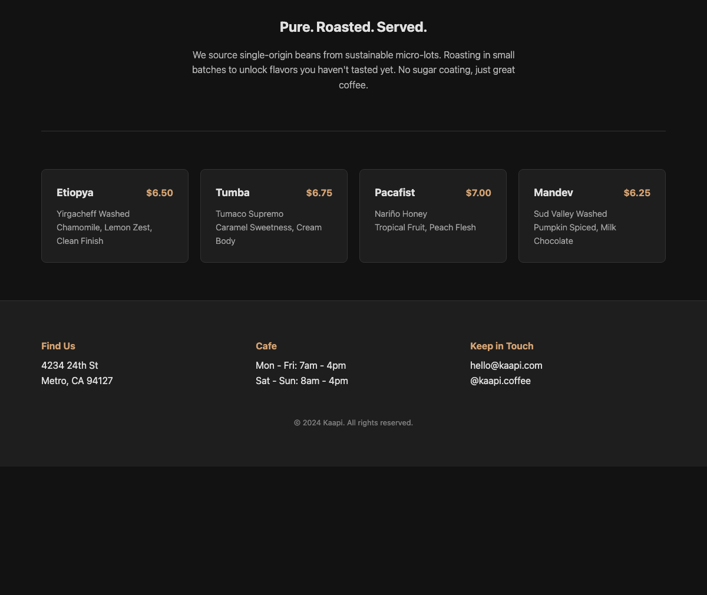

<div align="center">
  
  <h1>Samosa Chat</h1>
  <p><strong>Run Qwen3.6-35B-A3B as a local chat app on a 16 GB Apple Silicon Mac.</strong></p>
  <p>Runs on the CPU &nbsp;·&nbsp; No cloud account &nbsp;·&nbsp; No telemetry</p>
</div>

> **Credit.** Samosa Chat is built on [colibrì](https://github.com/JustVugg/colibri)
> by JustVugg. Its expert-streaming design, SIMD kernels, and core utility
> headers made this project possible. The model is the text part of
> [Qwen3.6-35B-A3B](https://huggingface.co/Qwen/Qwen3.6-35B-A3B), created and
> released by the Qwen team. Samosa Chat is an independent, unofficial,
> Apache-2.0 project. It is not affiliated with or endorsed by either team.

## What this is

Samosa Chat runs Qwen's 35-billion-parameter model on a Mac that has only 16 GB
of RAM.

The model is a Mixture of Experts. It has 35B parameters in total, but it only
uses about 3B of them for each token. Samosa never loads all 35B into memory.
The shared ("dense") weights stay in RAM. The expert weights are read from the
SSD as the model chooses which experts each token needs.

Samosa runs entirely on the CPU. It does not use Metal or the Apple GPU. You do
not need a dedicated GPU.

The model is text only. Qwen3.6 can also read images, but Samosa's converted
model leaves the image part out.

**Where it runs.** macOS on Apple Silicon (`arm64`) only. It has been tested on
one 16 GB M3 MacBook Air. "Runs on the CPU" does **not** mean it runs on any
16 GB laptop. The installer refuses other systems. Linux and Windows are not
supported.

## Two things you can get, and they are at different versions

There are two separate things. They are not at the same version, and the
difference is the single most important thing to understand here.

**1. The published download (Hugging Face).** One command installs it. You get
a command-line tool and an older version of the model. This download does **not**
include the browser app yet. This is the easiest way to try Samosa today.

**2. This repository (source).** This is the current, more advanced system. It
includes the browser chat app, the local server, and a newer, higher-quality
model format (called group-32). The browser app is **finished and working** —
it is what the maintainer uses every day. It is simply not packaged into the
Hugging Face download yet.

So: the **command-line tool is published** and easy to install. The **browser
app is done and working in this repository**, but you currently run it by
building from source, not from the published download.

## The three principles

Every decision follows these three goals, in this order:

1. **It must be stable on a machine like this one** — a 16 GB Apple Silicon Mac.
   Memory stays bounded. It does not grow without limit. It stops at clear
   limits instead of crashing.
2. **It must be actually useful.** Real answers, real code, real multi-turn
   conversations. Not a demo that only loads.
3. **It must not wear out the machine.** Keep memory bounded so the system does
   not swap heavily. Use two threads by default so the Mac stays cool. Be
   careful with the SSD reads that cause the real wear (explained below).

A feature is only called "released" once it meets all three. Until then it
stays in this repository as source.

## The browser app

`samosa app` starts a local server and opens a chat page in your browser.
Everything runs on your machine. The page makes no outside requests.

```sh
samosa serve          # start the server in the foreground on 127.0.0.1:8642
samosa app            # start the server in the background and open the chat page
samosa serve --stop   # stop the server
```

What the app does:

- Streams the answer as the model writes it.
- Shows the model's thinking separately from its final answer.
- Lets you stop a generation at any time.
- Saves your conversations so you can continue them later.
- Shows live speed (tokens per second) and current memory use.
- Has settings for thinking mode, maximum answer length, and a fixed seed.

The server answers these HTTP endpoints:

- `GET /healthz` — status, memory use, the context limit, queue state, last speed
- `GET /v1/models`
- `POST /v1/chat/completions` — reply as JSON, or stream token by token (SSE)
- `POST /v1/cancel` — stop the current generation
- `POST /v1/shutdown` — stop the server cleanly

Only one request runs at a time. Extra requests wait in a short queue.

**Stopping an answer is safe.** When you stop an answer partway through, Samosa
saves the conversation only up to the last complete sentence. This matters:
before this fix, if you stopped an answer in the middle of a sentence, the next
answer in that chat would copy the cut-off style and reply with only a word or
two before stopping. That is now fixed. If a stopped answer has no complete
sentence yet, Samosa keeps the previous saved state instead of overwriting it.

**Context limit.** Before a turn runs, Samosa checks it against a 24,576-token
limit. That limit covers the saved history, your new message, and the maximum
answer length, all added together. If a turn would go over, the server rejects
it before using any memory. Only the conversation you are using is loaded into
RAM. Opening other saved chats does not add to memory.

## Install the published command-line tool

```sh
curl -fsSL https://huggingface.co/deepanwa/Samosa-Chat-Qwen3.6-35B-A3B-int4/resolve/main/install.sh | sh
```

You need an Apple Silicon Mac, 16 GB of RAM, Apple's Command Line Tools (for the
C compiler), and about 25 GB of free disk. The download is about 18 GB. The
installer resumes interrupted downloads, checks SHA-256 checksums, compiles the
engine on your machine, and runs a quick test. It does not need administrator
rights.

```sh
samosa "explain how a hash table handles collisions"
samosa --continue "and which strategy does Python use?"
samosa --think "solve this logic puzzle"
samosa --long "write a detailed explanation"
samosa --fast "summarize this design"
samosa --seed 11 "give me a deterministic sample"
samosa doctor
```

By default an answer stops at 512 new tokens. `--long` raises that to 2,048. The
model often stops earlier on its own.

## Build and run from source

The browser app lives in this repository. To run it you need three things: the
compiled engine, the model files, and the tokenizer.

```sh
make            # portable CPU build
make omp        # multithreaded build (needs libomp on macOS)
make test       # run the bounded tests
```

`make` builds the engine only. It has no Python dependency. The model files come
from either the Hugging Face download (older model) or your own conversion with
`tools/convert_qwen36.py`. Once the engine and model are in place, `samosa serve`
and `samosa app` start the server. Full server details and the exact request
format are in [docs/SERVE_API.md](docs/SERVE_API.md).

Python is only used for conversion, analysis, and testing. It is not needed to
run the model.

## What Samosa adds on top of Qwen and colibrì

The Qwen model and the colibrì runtime are the starting point. This repository
adds:

- A Qwen3.6 text engine written in C. It covers the 30 Gated DeltaNet layers,
  the 10 gated attention layers, the shared and routed expert path, the
  tokenizer, and the chat template.
- A converter that turns the original Qwen checkpoint into Samosa's format,
  shard by shard, with a manifest-based container for the expert weights.
- Three weight formats: the older whole-row int4, the newer group-32 int4, and
  an experimental mixed format (group int4 for gate/up, row int8 for the
  down-projection).
- CPU math for those formats: Apple NEON dot-product on Apple Silicon, and a
  portable AVX2 path for other CPUs.
- An expert cache that keeps a fixed byte budget in RAM, drops the
  least-recently-used experts first, keeps a floor per layer, reuses freed
  memory, watches system memory pressure, and reports its I/O.
- Saved conversations (`QWSESS01` files) that are checked against the model
  geometry, sealed with a SHA-256 hash, written atomically, and can be resumed
  exactly.
- Qwen's published sampling settings for direct, general-thinking, and
  precise-code modes.
- A thinking-budget limit with a clean hand-off to the answer, separate counts
  for natural versus forced endings, and a guard that stops a repeating token
  loop.
- A local HTTP server in C with no dependencies: JSON or streaming replies, a
  bounded request queue, cancellation, health reporting, and clean shutdown.
- A 32 KB browser chat page with no external scripts, no analytics, and no
  outside requests, shipped with the Samosa logo.
- An installer that verifies and tests a new version in place before switching
  to it, and rolls back if the new version is bad.
- Test tooling for output structure, task correctness, upstream comparisons,
  the quantized math, route traces, installer rollback, and memory-pressure
  limits.

## Thinking modes

Samosa uses Qwen's published sampling settings:

| mode | temperature | top-p | top-k | presence penalty | thinking budget |
|---|---:|---:|---:|---:|---:|
| direct | 0.7 | 0.80 | 20 | 1.5 | off |
| general thinking | 1.0 | 0.95 | 20 | 1.5 | 1,024 tokens |
| precise code | 0.6 | 0.95 | 20 | 0.0 | 2,048 tokens |

The maximum answer length is an outer limit, up to 8,192 new tokens. It is not a
fixed length. The model decides when to stop within that limit. If the thinking
reaches its budget, Samosa adds Qwen's trained wind-down text before closing the
`</think>` block, rather than cutting it off with a bare token. Closing the
thinking block keeps the output well-formed; it does not prove the answer is
correct.

One test compared this against an upstream FP8 reference on a small set of
arithmetic problems. The reference used 353–616 thinking tokens. A matching
local group-32 run answered correctly and stopped on its own after 933 tokens
with a 1,024-token thinking budget. This confirms the path works for that one
kind of problem. It is not proof of broad benchmark quality. See the
[upstream-control report](docs/UPSTREAM_CONTROL_2026-07-14.md) and the
[regression ledger](docs/REGRESSION_LEDGER.md).

## The two model versions

Qwen describes the model as 35B parameters in total with about 3B used per
token, 40 layers, 256 routed experts, and 8 routed plus 1 shared expert active
in each Mixture-of-Experts layer.

Samosa has two model versions:

| version | expert weights | shared weights | status |
|---|---:|---:|---|
| older whole-row int4 | 16.6 GB | 1.3 GB | published on Hugging Face |
| newer group-32 int4 | 20.94 GB | 3.02 GB | tested locally, not published |

The group-32 version uses finer scaling data and larger shared int8 weights. It
reconstructs the original weights with less error than the older whole-row
format. One good reasoning run is not enough to call it fully proven, so it is
not published yet. The mixed int4/int8 format exists in code only; no full model
was built in it.

## Speed

All numbers are from one fanless MacBook Air M3 with 16 GB of RAM. They describe
specific runs on this one machine, not a guarantee for other machines.

| model and task | threads | speed |
|---|---:|---:|
| older model, normal decode | 2 | about 7–8 tokens/sec |
| older model, `--fast` decode | 4 | about 9.5 tokens/sec |
| older model, prefill | 2–4 | about 14–24 tokens/sec |
| group-32, direct answer | 2 | 7.27 tokens/sec |
| group-32, 933-token thinking answer | 2 | 4.85 tokens/sec |
| group-32, 5,000-token code page | 4 | 6.47 tokens/sec |

Decode is the speed of writing the answer. Prefill is the speed of reading your
input before it starts. Prefill is the slow part for long inputs: reading a
5,000-token document once takes about 3.5–6 minutes. Saved conversations mean a
document is read only once.

## Memory use

On the command-line tool, older runs used about 2.5–3 GB and group-32 runs used
about 3.2–3.9 GB.

In the app, memory grows in three stages:

1. **Model loaded, no chat yet:** about **2.5 GiB**.
2. **After the first answer:** about **3.9 GiB**. The first answer fills the
   expert cache, which adds about 1.3 GB and then holds steady.
3. **As a conversation gets longer:** memory rises slowly with the length of the
   conversation you are in. In one test it rose about 143 MB while a single chat
   grew from 176 to 1,017 tokens. The expert cache stayed flat at 1.29 GB the
   whole time.

That growth is bounded, not a leak. The per-token memory (the KV cache) is about
40 KiB per token across the 10 attention layers. The measured rise is a little
higher because the memory allocator holds on to its high point. For a
conversation of fixed length, memory levels off — an eight-turn test on the same
length held at **3.91–3.92 GiB**. The 24,576-token limit caps the worst case at
roughly **5–5.5 GiB** after a maximum-length chat. Only one conversation is in
memory at a time.

The memory number the app shows is the real macOS "physical footprint," which
matches Activity Monitor.

A note on swap: on macOS, swap can stay in use from an earlier busy period even
after memory frees up. macOS does not shrink the swap file or pull that data
back on its own. So swap being in use does **not** by itself mean Samosa is
swapping now. The signal to trust is green memory pressure.

Each saved turn writes a 63–70 MB sealed file to disk. The model files
themselves are read-only.

## SSD wear: the one thing to be deliberate about

This is the most important part for the health of your machine, so it is stated
plainly.

Samosa keeps memory small by **not** holding all 35B parameters in RAM. Instead
it reads each token's expert weights from the SSD as the model needs them. The
longer an answer is, the more expert data it reads. The same popular experts get
read again and again.

The amount is large. One 933-token thinking answer read **376 GB** of expert
data from the SSD. For comparison, swap — which people often worry about — is
tiny here: over the same session the whole system (Samosa, editor, browser, all
of it) wrote under about 9 GB to swap since the machine booted.

So the reads from expert streaming, not swap, are what actually wear the SSD,
and the amount scales with how long the model thinks.

What this means for you:

- **Longer thinking costs disk reads, not just time.** A short factual answer
  reads little. A long chain of thought reads a lot. Use direct mode
  (`thinking: off` in the app, `--direct` on the command line) when you do not
  need step-by-step reasoning.
- Two threads is the default so the Mac stays cool. `--fast` (4 threads) is
  something you choose on purpose.
- Real-model test runs are kept short on purpose, because one long thinking run
  can read hundreds of gigabytes.
- SSD speed and lifespan genuinely matter here. This is the basic trade-off of
  running a 35B model in 16 GB of RAM. It is not a bug. It is the one resource
  worth spending on purpose.

## Example answers

These were generated on the 16 GB reference Mac using the same older model
format that is on Hugging Face. The screenshot is not edited.

```sh
samosa --fast --long --seed 11 "Write a complete, single-file landing page (HTML with embedded CSS, \
no JavaScript) for a small specialty coffee shop called Kaapi. Include a hero section, \
a menu with four items, and a footer. Clean, modern, dark theme. Keep the CSS compact."
```

<p align="center"></p>

This run: 1,807 tokens, 9.60 tokens/sec, 2.47 GB peak memory. The published tool
needs `--long` to leave room for an answer this long.

The same model wrote this Python function:

```sh
samosa "Write a Python function merge_intervals(intervals) that merges overlapping \
intervals. Include type hints, a concise docstring, and three assert-based test cases."
```

```python
from typing import List, Tuple


def merge_intervals(intervals: List[Tuple[int, int]]) -> List[Tuple[int, int]]:
    """Merge overlapping intervals.

    Given a list of [start, end] pairs, merge all overlapping intervals.
    """

    if not intervals:
        return []

    # Sort by start time
    sorted_intervals = sorted(intervals, key=lambda x: x[0])

    merged = [sorted_intervals[0]]

    for current in sorted_intervals[1:]:
        last_start, last_end = merged[-1]
        new_start, new_end = current

        if new_start <= last_end:
            # Overlapping or adjacent, merge them
            merged[-1] = (last_start, max(last_end, new_end))
        else:
            merged.append(current)

    return merged
```

It passed the overlap, adjacent, empty-input, and unsorted-input tests. This
run: 191 tokens, 11.19 tokens/sec, 2.53 GB peak memory.

## Testing

`make test` covers the expert cache, the long-context KV math, the repetition
guard, the thinking wind-down, the quantized math, the server, the command-line
wrapper, installer rollback, output structure, route analysis, and the converter
layout. The multithreaded build and the shell and Python syntax checks also run.

An earlier test harness had a serious false positive: it reported 14 of 15
passes using substring checks, even though 0 of 15 answers actually closed their
`</think>` block. Structural closing, natural versus forced endings, repetition,
model stop, and task correctness are now scored separately. There is still not
enough evidence to publish a general benchmark score. The planned evaluation
steps are in [docs/BENCHMARK_PLAN.md](docs/BENCHMARK_PLAN.md).

## Privacy and machine safety

- The model runs on your machine. The engine has no telemetry. The server
  listens on local loopback only.
- The installer contacts Hugging Face only to download the public release files.
  Running the model does not need a cloud account.
- The macOS build is CPU-only. It uses NEON and optional OpenMP, not Metal.
- Two threads is the cool default. `--fast` is a deliberate choice.
- The expert cache watches memory pressure and can drop cached experts before
  the system is forced to swap.
- In the server, a generation can be cancelled between tokens.
- Real-model test runs are kept short because one long run can read hundreds of
  gigabytes from the SSD.

## What is not done yet

- The published model still uses the coarse whole-row int4 format. It can make
  small word-level mistakes such as `of ofof`. Asking again or changing the seed
  can avoid a given case but does not fully fix it.
- The group-32 model is promising but not broadly tested or published.
- Some app features are still planned: keeping recent conversations in RAM
  instead of reading them from disk each turn, managing transcripts on the
  server, chatting over a document, and web access. Deleting a chat in the app
  removes it from the browser but does not yet delete its saved file on disk.
- Long-answer coverage is still thin. A crash above 4,096 tokens was fixed, but
  the planned test for very long answers is not written yet.
- Only macOS on Apple Silicon has been tested as a product. Linux code paths
  exist but are unverified. Windows is not supported.
- There is no Metal (GPU) support yet. It is a planned optimization. For now,
  part of the work is limited by SSD read speed.
- Text only. No images, video, audio, tool calling, or Qwen's vision part.
- SSD speed and lifespan matter, because expert weights are streamed and reread
  many times during long answers.

## More documentation

- [App task program](docs/APP_TASKS.md)
- [Server API and acceptance tests](docs/SERVE_API.md)
- [Thinking-mode diagnosis](docs/THINKING_DIAGNOSIS.md)
- [Group-32 model notes](docs/GROUP32_BASELINE.md)
- [Storage migration log](docs/STORAGE_MIGRATION_2026-07-14.md)
- [Upstream comparison](docs/UPSTREAM_CONTROL_2026-07-14.md)
- [Detailed work log](docs/WORK_LOG_2026-07-14.md)

## License

Apache-2.0. See [LICENSE](LICENSE) and [NOTICE](NOTICE) for the full attribution
and derivative-work notice.
